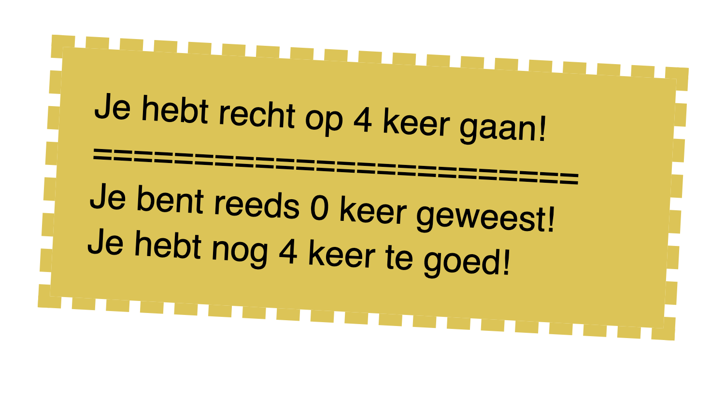

# 💻 Computational thinking

> Bij **computational thinking** wordt datgene wat de computer moet doen op een zodanige manier aan de computer "verteld" dat de computer snapt wat die moet doen!

> Computational thinking is niet alleen handig voor het bedenken van taken die een computer moet doen om een probleem op te lossen. Een CMD student kan dit ook als techniek gebruiken om een complex probleem te vereenvoudigen, zodat deze vertaald kan worden naar een praktische oplossing.

## 🎢 Gratis ritjes in het reuzenrad op de kermis!

Een kermis uitbater bedenkt een actie om kermisklanten gratis ritjes op het reuzenrad aan te bieden. Bedenk een oplossing die voor de kermisklant en de uitbater inzicht kan verschaffen tijdens het faciliteren van de gratis ritjes op het reuzenrad!

- Wat is minimaal nodig voor het faciliteren van de gratis ritjes op het reuzenrad?
- Hoe zou je kunnen bijhouden hoeveel ritjes de kermisklant nog te goed heeft?
- Hoe zou de uitbater kunnen bijhouden hoeveel ritjes de klant al heeft gemaakt?
- Een stempelkaart misschien?

